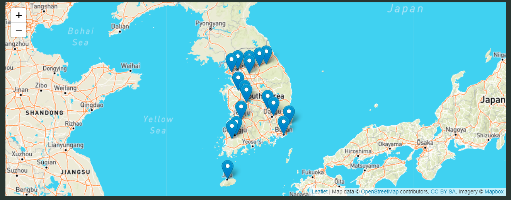

# South-Korea-Coronavirus-Dashboard

This is a joint project created by Gabe Djeudeu, Eli Krash, and Jason Cristini. We wanted to determine the impact of coronavirus around the world and started with a well documented country's statistics like South Korea. We also wanted to answer questions like: is there a correlation between contractions and temperature, which province was hit the hardest, what age group contracted the at the highest percent, and which age group was a the greatest risk of death. In order to do this, we started with multiple csv's from Kaggle.com which reported the cases, deaths, locations, ages, and other important metrics and loaded them into a PostgreSQL database. We then used a Flask API to access the database and run the visualizations. 

The first visualization is a user responsive map that displays the province that the user inputs. This map has markers on it that display both the number of cases as well as the deaths in that province. Below are images of this map. 

   

Next we wanted to answer the question about correlation between average temperature per province and number of cases. Below is that visualization. As you can see from the scatter plot, there does not seem to be any correlation between the average temperature and number of cases, with Daegu being a large outlyer. 

